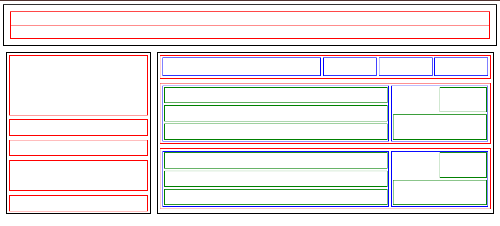

# 📐 Layout Design – HTML & CSS Project

## 📌 Project Overview

This project is a layout design created using **HTML and CSS**.  
It demonstrates structured layout building with:

- Navigation bar
- Left and right columns
- Nested boxes
- Borders and flexbox-based alignment

The project is useful for learning layout structuring and UI grid concepts.

---

## 🛠 Technologies Used

- HTML5
- CSS3 (Flexbox)

---

## 📂 Project Structure

```
project-folder/
│
└── index.html
```

---

## 📸 Project Screenshot



---

## 🚀 How to Run the Project

1. Download or clone the repository.
2. Open the project folder.
3. Double-click on `index.html`.
4. The layout will render in your browser.

---

## 📱 Responsiveness

- Flexbox is used for layout alignment
- Container-based sizing
- Adaptive structure for different screen sizes

---

## 👩‍💻 Author

Asma Shahzadi  
Full Stack Developer

---

## 📜 License

This project is created for educational and learning purposes.
